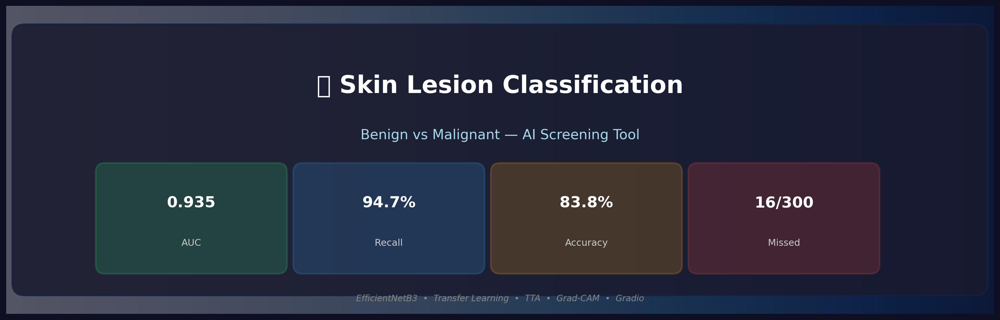
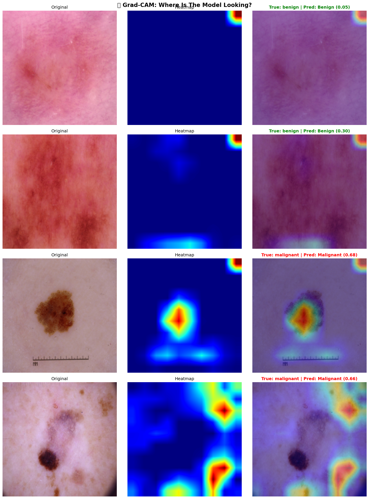

# 🏥 Skin Lesion Classification: Benign vs Malignant

<p align="center">
  
</p>

<p align="center">
  
  
  
  
  
</p>

## 📋 Overview

A deep learning-based screening tool that classifies skin lesion images
as **benign** or **malignant** using EfficientNetB3 with transfer learning,
threshold optimization, test-time augmentation (TTA), and Grad-CAM explainability.

| Metric | Score |
|---|---|
| **AUC-ROC** | 0.935 |
| **Cancer Detection (Recall)** | 94.7% |
| **Accuracy** | 83.8% |
| **F1 Score** | 0.842 |
| **MCC** | 0.698 |
| **Missed Cancers** | Only 16/300 (5.3%) |

> ⚕️ **Disclaimer:** For educational/screening purposes only.
> Not a substitute for professional medical diagnosis.

---

## 🏗️ Architecture

```
Input Image (300×300×3)
    │
    ▼
EfficientNetB3 (Pre-trained ImageNet)
    │  Phase 1: Frozen base
    │  Phase 2: Fine-tuned last 50 layers
    ▼
GlobalAveragePooling2D
    │
BatchNormalization
    │
Dense(512, ReLU) → Dropout(0.5)
Dense(256, ReLU) → Dropout(0.4)
Dense(128, ReLU) → Dropout(0.3)
    │
Dense(1, Sigmoid) → Benign (0) / Malignant (1)
    │
    ▼
Threshold Optimization (0.38) + Test-Time Augmentation (10 rounds)
```

---

## 📁 Project Structure

```
skin-lesion-classification/
├── README.md                                  ← Project documentation
├── requirements.txt                           ← Dependencies
├── final_config.json                          ← Model config
├── .gitignore                                 ← Excludes .keras files
├── notebooks/
│   └── skin_lesion_classification_v2.ipynb    ← Clean Colab notebook
├── app/
│   └── gradio_app.py                          ← Standalone Gradio app
├── assets/
│   ├── banner.png                             ← Project banner
│   ├── training_history.png                   ← Training curves
│   ├── confusion_matrix.png                   ← CM plot
│   ├── roc_curve.png                          ← ROC curve
│   ├── score_distribution.png                 ← Score distribution
│   ├── complete_evaluation.png                ← All metrics visual
│   ├── gradcam_samples.png                    ← Grad-CAM examples
│   ├── error_analysis.png                     ← Wrong predictions
│   ├── class_distribution.png                 ← Dataset EDA
│   ├── final_evaluation.png                   ← final metrics
│   └── sample_images.png                      ← Sample images
├── docs/
│   ├── model_evaluation_report.md             ← Full eval report
│   └── deployment_guide.md                    ← Deployment instructions
└── samples/
    ├── benign/
    │   ├── image1.jpg
    │   └── image2.jpg
    └── malignant/
        ├── image1.jpg
        └── image2.jpg
```

---

## 📥 Model Downloads

Models are hosted on **HuggingFace** (too large for GitHub):

| File | Size | Link |
|---|---|---|
| `model_b3.keras` | ~96.4 MB | [HuggingFace Space](https://huggingface.co/spaces/code-with-zeeshan/skin-lesion-classifier/blob/main/model_b3.keras) |
| `model_b0.keras` | ~33.4 MB | [HuggingFace Space](https://huggingface.co/spaces/code-with-zeeshan/skin-lesion-classifier/blob/main/model_b0.keras) |
| `final_config.json` | 1 KB | Included in this repo |

### Automatic Download
The Gradio app **automatically downloads** models from HuggingFace on first run:
```bash
python app/gradio_app.py
```

### Manual Download
```python
from huggingface_hub import hf_hub_download

model_path = hf_hub_download(
    repo_id="code-with-zeeshan/skin-lesion-classifier",
    filename="model_b3.keras",
    repo_type="space"
)
```

---

## ⚙️ Two Prediction Modes

| Mode | AUC | Recall | Accuracy | Speed |
|---|---|---|---|---|
| ⚡ **Fast Mode** | 0.911 | 90.0% | 81.7% | ~2 sec |
| 🎯 **Best Mode (TTA)** | 0.935 | 94.7% | 83.8% | ~20 sec |

---

## 🔧 Key Technical Decisions

### 1. Why EfficientNetB3?
- **Compound scaling** optimizes depth, width, and resolution simultaneously
- 81.6% ImageNet accuracy with only 12.3M parameters
- Superior accuracy-per-parameter vs ResNet50 (25.6M params, 76.1% accuracy)
- Built-in preprocessing eliminates manual rescaling errors

### 2. Why NO `rescale=1./255`?
EfficientNet has **internal preprocessing layers** expecting [0, 255] input.
Adding `rescale=1./255` causes double preprocessing → model receives garbage
values → learns nothing (predicts all one class). This was our first major
bug fix.

### 3. Why Two-Phase Training?
- **Phase 1 (Frozen):** Trains only the custom head while preserving ImageNet features
- **Phase 2 (Fine-tune):** Unfreezes last 50 layers with 10× smaller learning rate
  to adapt base features to skin lesion domain without catastrophic forgetting

### 4. Why Threshold Optimization?
Default 0.5 threshold gave 82% recall. In medical screening, missing cancers
(false negatives) is more dangerous than false alarms. Optimized threshold
(0.38) targets ≥90% recall, accepting slightly more false alarms for safety.

### 5. Why Test-Time Augmentation?
TTA averages predictions over 10 augmented versions of each image.
Free +2.4% AUC improvement with zero retraining. Single biggest
no-cost accuracy boost.

---

## 📊 Results

### Evolution of the Model

| Stage | AUC | Recall | Missed Cancers | Key Change |
|---|---|---|---|---|
| Broken V1 | 0.349 | 0.0% | 300/300 | Bug: double preprocessing |
| Fixed V1 (B0) | 0.908 | 85.7% | 43/300 | Removed rescale, optimized threshold |
| V2 (B3) | 0.911 | 90.0% | 30/300 | Upgraded to EfficientNetB3 |
| **V2 (B3+TTA)** | **0.935** | **94.7%** | **16/300** | Added test-time augmentation |

### Final Metrics (B3 + TTA on Unseen Test Data)

| Metric | Score | Grade |
|---|---|---|
| AUC-ROC | 0.935 | 🟢 Good |
| Accuracy | 83.8% | 🟡 Okay |
| Balanced Accuracy | 84.7% | 🟡 Okay |
| Sensitivity (Recall) | 94.7% | 🏆 Excellent |
| Specificity | 74.7% | 🟡 Okay |
| Precision (Malignant) | 75.7% | 🟡 Okay |
| F1 Score (Malignant) | 0.842 | 🟡 Okay |
| MCC | 0.698 | 🟢 Good |
| NPV | 94.4% | 🏆 Excellent |
| **Overall Verdict** | | **🟢 Good — Reliable for Screening** |

### Confusion Matrix

```
                    Predicted Benign    Predicted Malignant
Actual Benign            269                 91
Actual Malignant          16                284
```

---

## 🔥 Features

- 📷 **Image Upload:** Upload any skin lesion image
- 👤 **Patient Info:** Name, age, gender for personalized report
- 🔬 **Prediction:** Benign vs Malignant with confidence score
- 🔥 **Grad-CAM:** Visual explanation of model focus areas
- 🛡️ **Precautions:** Automated medical precaution report
- ⚡ **Two Modes:** Fast (single prediction) or Best (TTA)

---

## 🔥 Grad-CAM Visualization

<p align="center">
  
</p>

Grad-CAM shows the model focuses on lesion borders, color variations,
and texture irregularities — consistent with dermatological diagnostic criteria.

---

## 🚀 Quick Start

### Prerequisites
```bash
pip install -r requirements.txt
```

### Run Gradio App (Downloads model automatically)
```bash
python app/gradio_app.py
```

### Run Inference (Code)
```python
from tensorflow.keras.models import load_model
import numpy as np, json
from tensorflow.keras.preprocessing import image

model = load_model('model_b3.keras')
config = json.load(open('final_config.json'))

img = image.load_img('path/to/lesion.jpg', target_size=(300, 300))
img_array = np.expand_dims(image.img_to_array(img), axis=0)  # No /255!
pred = model.predict(img_array)[0][0]

label = "MALIGNANT" if pred >= config['threshold'] else "BENIGN"
print(f"{label} (score: {pred:.4f})")
```

---

## 🔄 How to Reproduce

1. **Clone the repository:**
   ```bash
   git clone https://github.com/code-with-zeeshan/skin-lesion-classification.git
   cd skin-lesion-classification
   ```

2. **Install dependencies:**
   ```bash
   pip install -r requirements.txt
   ```

3. **Option A — Run Gradio App (uses pre-trained model):**
   ```bash
   python app/gradio_app.py
   ```

4. **Option B — Retrain from scratch:**
   - Open `notebooks/skin_lesion_classification_v2.ipynb` in Google Colab
   - Upload the Skin Lesions Classification dataset to Google Drive
   - Run all cells in order
   - Training takes ~30-45 minutes on Colab GPU

5. **Option C — Open in Colab directly:**

   [](https://colab.research.google.com/github/code-with-zeeshan/skin-lesion-classification/blob/main/notebooks/skin_lesion_classification_v2.ipynb)

---

## 📈 Lessons Learned

### Bugs Encountered & Fixed
| Bug | Impact | Fix |
|---|---|---|
| `rescale=1./255` with EfficientNet | Model predicted all benign (AUC: 0.35) | Removed rescaling — EfficientNet has built-in preprocessing |
| `layer.output_shape` in Grad-CAM | AttributeError in TF 2.16+ | Hardcoded `top_activation` layer name |
| Default threshold (0.5) | 82% recall → missed many cancers | Threshold optimization → 94.7% recall |
| Gradio 6.0 breaking changes | `theme` and `show_copy_button` errors | Removed deprecated parameters |

### What Worked Best
1. **Transfer learning** > training from scratch (small dataset)
2. **Threshold optimization** gave the biggest practical improvement
3. **TTA** provided free +2.4% AUC boost
4. **Class weights** helped with mild imbalance

### What Didn't Help Much
1. **EfficientNetB3 vs B0:** Only marginal AUC improvement
2. **Ensemble (B0+B3):** Didn't beat B3+TTA alone
3. Both hit the same ~0.93 AUC ceiling → **dataset size is the bottleneck**

---

## 🛠️ Tools & Acknowledgments

- **AI Assistance:** [Claude AI](https://claude.ai) (Anthropic) was used as
  a productivity tool for:
  - Code generation and debugging
  - Model architecture suggestions
  - Performance analysis and optimization recommendations
  - Documentation structure guidance

  All experimental decisions, hyperparameter choices, result interpretation,
  and project direction were made by the author. Claude served as an
  accelerator — similar to using Stack Overflow or documentation — not as
  the decision maker.

- **Framework:** TensorFlow 2.x / Keras
- **Pre-trained Model:** EfficientNetB3 (ImageNet weights)
- **Deployment:** Gradio
- **Environment:** Google Colab (GPU runtime)

---

## Docs
- [Deployment](docs/deployment_guide.md)
- [Evaluation](docs/model_evaluation_report.md)

---

## Demo Video
- [Demo](assets/Skin_Lesion_Classification_demo.gif)

## 🔮 Future Improvements

- [ ] Add more training data (ISIC Archive: 25,000+ images)
- [ ] Try advanced augmentation (albumentations: CLAHE, elastic transform)
- [ ] Implement 5-fold cross-validation for more robust evaluation
- [ ] Deploy permanently on HuggingFace Spaces [DEPLOYED](https://huggingface.co/spaces/code-with-zeeshan/skin-lesion-classifier)
- [ ] Add multi-class classification (melanoma, BCC, SCC, etc.)

---

## 📄 License

This project is for educational purposes only. Not intended for clinical use.

---

## 📬 Contact

MOHAMMAD ZEESHAN — [LinkedIn](https://www.linkedin.com/in/mohammad-zeeshan-37637a1a5)

